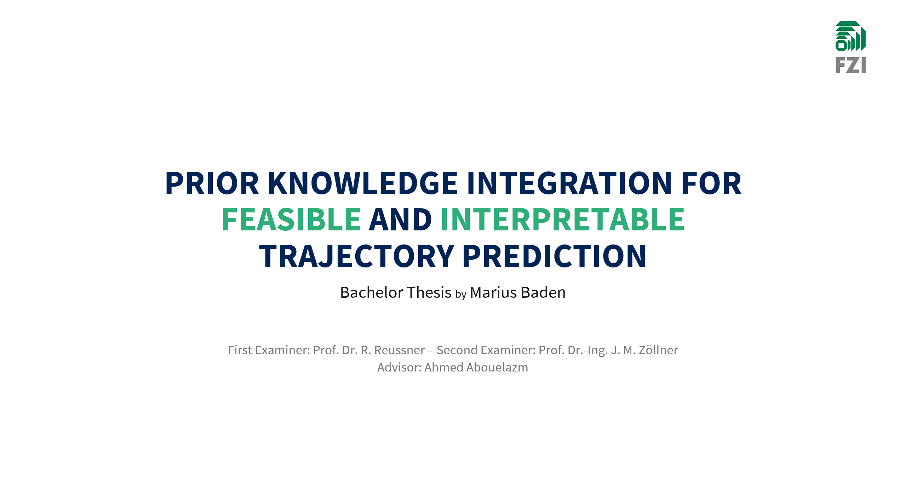
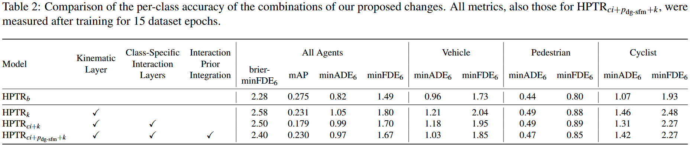

## Summary

A Transformer neural network for autonomous driving to predict the future behavior of surrounding road users.
It makes encoded interactions more interpretable and guarantees that its predictions adhere to physics.
<!-- In contrast to previous state-of-the-art approaches, it makes the encoded interactions between agents more interpretable and guarantees that its predictions adhere to the physics of motion. -->

I have developed it as my bachelor's thesis project (Grade 1.0):
[thesis.pdf](assets/bachelor-thesis_marius-baden_feasible-interpretable-trajectory-prediction.pdf).

I have published the findings of this project as a [conference paper](https://arxiv.org/abs/2505.06743) to IEEE IV 25. There, I was selected for an oral presentation.

## Demo
See the neural network in action: It predicts the future motions for all road users in the scene. It first makes 6 predictions and then selects the most probable of them. 

https://github.com/user-attachments/assets/6ff1ccbe-0a4b-4706-a87d-795d598ef446

The network's predictions are drawn in cyan. The orange trajectory depicts the ground-truth.

## Description

I developed this network for my bachelor's thesis "*Prior Knowledge Integration for Feasible and Interpretable Trajectory Prediction*" during a 6-months part-time (25h/week) position as thesis student at the [FZI Research Center for Information Technology](https://www.fzi.de/).

### Experience Gained

- **Designed, trained, and evaluated** a neural network (Transformer) in Python with PyTorch for trajectory prediction of road users that **guarantees physical feasibility** and **improves interpretability** to make autonomous driving safer
- Visualized and pre-processed 250,000 traffic scenarios from **real vehicle data gathered by ArgoAI test vehicles**
- **Analyzed and cleaned the training dataset** by identifying scenarios with physically infeasible motions 

### Technologies Used

- **Python** programming language
- **PyTorch** machine learning framework
- **ClearML** for ML Ops and tracking training
- **Transformer** neural network architecture 

## Research Insights

### Overview

Trajectory prediction is crucial for autonomous driving to navigate safely by anticipating the
movements of surrounding road users. However, current deep learning models often lack alignment
with human reasoning, leading to predictions that are physically infeasible or are not logical
to a human. 

To address this challenge, recent research has incorporated prior expert knowledge,
like the social force model for modeling interactions and kinematic models for physical
realism. However, these approaches do not evaluate the impact of the added expert knowledge
on the network’s interpretability and mainly focus on priors that either suit vehicles or pedestrians
but do not generalize to all agent types.

### Method

In contrast to the state-of-the-art, we propose incorporating priors for
interactions and kinematics of all agent classes – specifically vehicles, pedestrians, and cyclists
– with class-specific layers to capture the differences in the rationale for each class. To improve
interaction interpretability, we guide an agent-to-agent attention layer with rule-based interaction
importance scores. We compare two prior models for calculating these scores and two
integration methods for guiding attention. To ensure kinematic feasibility, we let the network
predict control inputs, from which kinematic models then compute trajectories. 

### Results

We benchmarked our proposed modifications on the Argoverse 2 Motion Forecasting dataset, using the state-of-
the-art deep neural network HPTR as our baseline. 
Our experiments demonstrate that we improve interpretability without degrading prediction accuracy, finding a correlation between incorrect predictions and a divergence of the model’s attention from our interaction prior. Even
though incorporating the kinematic models causes a slight decrease in accuracy, they more than
compensate by eliminating infeasible motions present in both the dataset and particularly in the
baseline model’s predictions, where up to 88% of predictions are impossible in reality. Thus,
our approach ensures that predicted trajectories are both interpretable and kinematically feasible,
contributing to safer and more reliable trajectory prediction.

## Credits

The network is based on [HPTR](https://github.com/zhejz/HPTR/), one of the leading trajectory prediction models.
My work was supervised by Ahmed Abouelazm at the [FZI Research Center for Information Technology](https://www.fzi.de/).
